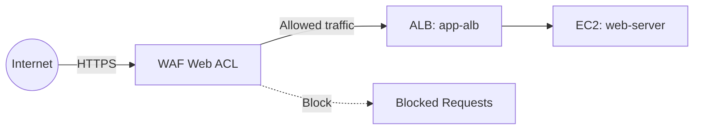

# Deploy WAF with Application Load Balancer on AWS

This guide demonstrates how to use MechCloud's stateless IaC to provision an AWS WAF Web ACL attached to an Application Load Balancer for web application protection.

## Scenario Overview
**Use Case:** Protecting a web application from common exploits like SQL injection, XSS, and bot traffic by deploying AWS WAF with managed rule groups in front of an ALB — essential for any internet-facing application.
**Key MechCloud Features Highlighted:**
- Cross-resource referencing (`ref:`)
- Complex nested rule configuration as clean YAML
- WAF association with ALB

### Architecture Diagram



***

### Complete Unified Template

```yaml
resources:
  - type: aws_ec2_vpc
    name: vpc1
    props:
      cidr_block: "10.0.0.0/16"
    resources:
      - type: aws_ec2_internet_gateway
        name: igw1
      - type: aws_ec2_route_table
        name: public_rt
        resources:
          - type: aws_ec2_route
            name: internet_route
            props:
              destination_cidr_block: "0.0.0.0/0"
              gateway_id: "ref:vpc1/igw1"
      - type: aws_ec2_security_group
        name: sg-alb
        props:
          group_name: "mc-waf-alb-sg"
          group_description: "SG for ALB behind WAF"
          security_group_ingress:
            - ip_protocol: tcp
              from_port: 80
              to_port: 80
              cidr_ip: "0.0.0.0/0"
      - type: aws_ec2_security_group
        name: sg-ec2
        props:
          group_name: "mc-waf-ec2-sg"
          group_description: "SG for EC2 behind ALB"
          security_group_ingress:
            - ip_protocol: tcp
              from_port: 80
              to_port: 80
              source_security_group_id: "ref:vpc1/sg-alb"
      - type: aws_ec2_subnet
        name: subnet-a
        props:
          cidr_block: "10.0.1.0/24"
          availability_zone: "{{CURRENT_REGION}}a"
        resources:
          - type: aws_ec2_route_table_association
            name: rta-a
            props:
              route_table_id: "ref:vpc1/public_rt"
          - type: aws_ec2_instance
            name: web-server
            props:
              image_id: "{{Image|arm64_ubuntu_24_04}}"
              instance_type: "t4g.small"
              security_group_ids:
                - "ref:vpc1/sg-ec2"
      - type: aws_ec2_subnet
        name: subnet-b
        props:
          cidr_block: "10.0.2.0/24"
          availability_zone: "{{CURRENT_REGION}}b"
        resources:
          - type: aws_ec2_route_table_association
            name: rta-b
            props:
              route_table_id: "ref:vpc1/public_rt"

  - type: aws_elbv2_load_balancer
    name: app-alb
    props:
      type: application
      scheme: internet-facing
      security_groups:
        - "ref:vpc1/sg-alb"
      subnets:
        - "ref:vpc1/subnet-a"
        - "ref:vpc1/subnet-b"

  - type: aws_elbv2_target_group
    name: app-tg
    props:
      port: 80
      protocol: HTTP
      vpc_id: "ref:vpc1"
      target_type: instance
      health_check:
        path: "/"

  - type: aws_elbv2_listener
    name: http-listener
    props:
      load_balancer_arn: "ref:app-alb"
      port: 80
      protocol: HTTP
      default_actions:
        - type: forward
          target_group_arn: "ref:app-tg"

  - type: aws_wafv2_web_acl
    name: app-waf
    props:
      name: "mc-app-waf"
      scope: REGIONAL
      default_action:
        allow: {}
      visibility_config:
        cloudwatch_metrics_enabled: true
        metric_name: "mc-app-waf"
        sampled_requests_enabled: true
      rules:
        - name: AWS-AWSManagedRulesCommonRuleSet
          priority: 1
          override_action:
            none: {}
          statement:
            managed_rule_group_statement:
              vendor_name: AWS
              name: AWSManagedRulesCommonRuleSet
          visibility_config:
            cloudwatch_metrics_enabled: true
            metric_name: common-rules
            sampled_requests_enabled: true
        - name: AWS-AWSManagedRulesSQLiRuleSet
          priority: 2
          override_action:
            none: {}
          statement:
            managed_rule_group_statement:
              vendor_name: AWS
              name: AWSManagedRulesSQLiRuleSet
          visibility_config:
            cloudwatch_metrics_enabled: true
            metric_name: sqli-rules
            sampled_requests_enabled: true
        - name: RateLimit
          priority: 3
          action:
            block: {}
          statement:
            rate_based_statement:
              limit: 2000
              aggregate_key_type: IP
          visibility_config:
            cloudwatch_metrics_enabled: true
            metric_name: rate-limit
            sampled_requests_enabled: true

  - type: aws_wafv2_web_acl_association
    name: waf-alb-assoc
    props:
      resource_arn: "ref:app-alb.arn"
      web_acl_arn: "ref:app-waf.arn"
```
