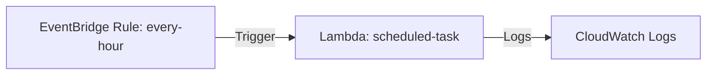

# Deploy EventBridge Scheduled Lambda on AWS

This guide demonstrates how to use MechCloud's stateless IaC to provision an EventBridge rule that triggers a Lambda function on a cron schedule for automated tasks.

## Scenario Overview
**Use Case:** Automated scheduled tasks like database cleanup, report generation, health checks, or data synchronization — replacing traditional cron jobs with serverless, fully managed scheduling.
**Key MechCloud Features Highlighted:**
- Cross-resource referencing (`ref:`)
- EventBridge schedule expression as simple YAML
- No state management for event-driven resources

### Architecture Diagram



***

### Complete Unified Template

```yaml
resources:
  - type: aws_iam_role
    name: lambda-role
    props:
      role_name: "mc-scheduled-lambda-role"
      assume_role_policy_document:
        Version: "2012-10-17"
        Statement:
          - Effect: Allow
            Principal:
              Service: lambda.amazonaws.com
            Action: "sts:AssumeRole"
      managed_policy_arns:
        - "arn:aws:iam::aws:policy/service-role/AWSLambdaBasicExecutionRole"

  - type: aws_lambda_function
    name: scheduled-task
    props:
      function_name: "mc-scheduled-task"
      runtime: python3.12
      handler: index.handler
      role: "ref:lambda-role.arn"
      memory_size: 256
      timeout: 300
      code:
        zip_file: |
          import datetime
          def handler(event, context):
              print(f"Scheduled task running at {datetime.datetime.now()}")
              return {'status': 'completed'}

  - type: aws_events_rule
    name: every-hour
    props:
      name: "mc-hourly-trigger"
      description: "Trigger Lambda every hour"
      schedule_expression: "rate(1 hour)"
      state: ENABLED

  - type: aws_events_target
    name: lambda-target
    props:
      rule: "ref:every-hour"
      arn: "ref:scheduled-task.arn"

  - type: aws_lambda_permission
    name: eventbridge-invoke
    props:
      function_name: "ref:scheduled-task"
      action: "lambda:InvokeFunction"
      principal: events.amazonaws.com
      source_arn: "ref:every-hour.arn"
```
