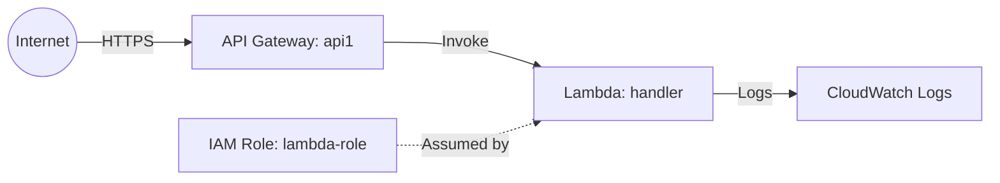

# Deploy a Lambda Function with API Gateway on AWS

This guide demonstrates how to use MechCloud's stateless IaC to provision an AWS Lambda function fronted by an API Gateway HTTP API for serverless REST endpoints.

## Scenario Overview
**Use Case:** A serverless REST API that scales automatically to zero, with no server management — ideal for microservices, webhooks, and lightweight APIs that have variable or unpredictable traffic.
**Key MechCloud Features Highlighted:**
- Cross-resource referencing (`ref:`)
- Serverless compute without infrastructure overhead
- No state file management needed

### Architecture Diagram



***

### Complete Unified Template

```yaml
resources:
  - type: aws_iam_role
    name: lambda-role
    props:
      role_name: "mc-lambda-role"
      assume_role_policy_document:
        Version: "2012-10-17"
        Statement:
          - Effect: Allow
            Principal:
              Service: lambda.amazonaws.com
            Action: "sts:AssumeRole"
      managed_policy_arns:
        - "arn:aws:iam::aws:policy/service-role/AWSLambdaBasicExecutionRole"

  - type: aws_lambda_function
    name: handler
    props:
      function_name: "mc-api-handler"
      runtime: python3.12
      handler: index.handler
      role: "ref:lambda-role.arn"
      memory_size: 256
      timeout: 30
      code:
        zip_file: |
          def handler(event, context):
              return {
                  'statusCode': 200,
                  'body': '{"message": "Hello from MechCloud!"}'
              }
      environment:
        variables:
          STAGE: production

  - type: aws_apigatewayv2_api
    name: api1
    props:
      name: "mc-api"
      protocol_type: HTTP

  - type: aws_apigatewayv2_integration
    name: lambda-integration
    props:
      api_id: "ref:api1"
      integration_type: AWS_PROXY
      integration_uri: "ref:handler.arn"
      payload_format_version: "2.0"

  - type: aws_apigatewayv2_route
    name: default-route
    props:
      api_id: "ref:api1"
      route_key: "ANY /{proxy+}"
      target: "ref:lambda-integration"

  - type: aws_apigatewayv2_stage
    name: default-stage
    props:
      api_id: "ref:api1"
      name: "$default"
      auto_deploy: true

  - type: aws_lambda_permission
    name: apigw-invoke
    props:
      function_name: "ref:handler"
      action: "lambda:InvokeFunction"
      principal: apigateway.amazonaws.com
      source_arn: "ref:api1.execution_arn/*/*"
```
