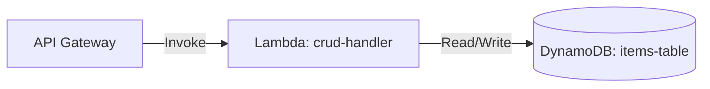

# Deploy a Lambda Function with DynamoDB Table on AWS

This guide demonstrates how to use MechCloud's stateless IaC to provision a Lambda function with a DynamoDB table for serverless CRUD operations.

## Scenario Overview
**Use Case:** A serverless API backend where Lambda handles business logic and DynamoDB provides a fully managed NoSQL database — ideal for REST APIs, mobile backends, and event-driven data processing without provisioning any servers.
**Key MechCloud Features Highlighted:**
- Cross-resource referencing (`ref:`)
- IAM policy with table-specific permissions
- Serverless stack in a single template

### Architecture Diagram



***

### Complete Unified Template

```yaml
resources:
  - type: aws_iam_role
    name: lambda-role
    props:
      role_name: "mc-ddb-lambda-role"
      assume_role_policy_document:
        Version: "2012-10-17"
        Statement:
          - Effect: Allow
            Principal:
              Service: lambda.amazonaws.com
            Action: "sts:AssumeRole"
      managed_policy_arns:
        - "arn:aws:iam::aws:policy/service-role/AWSLambdaBasicExecutionRole"

  - type: aws_dynamodb_table
    name: items-table
    props:
      table_name: "mc-items"
      billing_mode: PAY_PER_REQUEST
      hash_key: itemId
      attribute_definitions:
        - attribute_name: itemId
          attribute_type: S
      point_in_time_recovery:
        enabled: true

  - type: aws_iam_policy
    name: ddb-policy
    props:
      policy_name: "mc-ddb-crud-policy"
      policy_document:
        Version: "2012-10-17"
        Statement:
          - Effect: Allow
            Action:
              - "dynamodb:GetItem"
              - "dynamodb:PutItem"
              - "dynamodb:UpdateItem"
              - "dynamodb:DeleteItem"
              - "dynamodb:Query"
              - "dynamodb:Scan"
            Resource: "ref:items-table.arn"

  - type: aws_iam_role_policy_attachment
    name: attach-ddb
    props:
      role: "ref:lambda-role"
      policy_arn: "ref:ddb-policy.arn"

  - type: aws_lambda_function
    name: crud-handler
    props:
      function_name: "mc-crud-handler"
      runtime: python3.12
      handler: index.handler
      role: "ref:lambda-role.arn"
      memory_size: 256
      timeout: 30
      environment:
        variables:
          TABLE_NAME: "ref:items-table"
      code:
        zip_file: |
          import os, json, boto3
          ddb = boto3.resource('dynamodb')
          table = ddb.Table(os.environ['TABLE_NAME'])
          def handler(event, context):
              method = event.get('httpMethod', 'GET')
              if method == 'GET':
                  result = table.scan()
                  return {'statusCode': 200, 'body': json.dumps(result['Items'])}
              return {'statusCode': 200, 'body': '{"status":"ok"}'}

  - type: aws_apigatewayv2_api
    name: api1
    props:
      name: "mc-crud-api"
      protocol_type: HTTP

  - type: aws_apigatewayv2_integration
    name: lambda-integration
    props:
      api_id: "ref:api1"
      integration_type: AWS_PROXY
      integration_uri: "ref:crud-handler.arn"
      payload_format_version: "2.0"

  - type: aws_apigatewayv2_route
    name: crud-route
    props:
      api_id: "ref:api1"
      route_key: "ANY /{proxy+}"
      target: "ref:lambda-integration"

  - type: aws_apigatewayv2_stage
    name: default-stage
    props:
      api_id: "ref:api1"
      name: "$default"
      auto_deploy: true

  - type: aws_lambda_permission
    name: apigw-invoke
    props:
      function_name: "ref:crud-handler"
      action: "lambda:InvokeFunction"
      principal: apigateway.amazonaws.com
      source_arn: "ref:api1.execution_arn/*/*"
```
