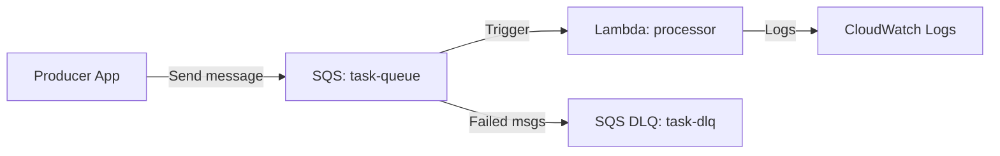

# Deploy a Lambda Function with SQS Event Trigger on AWS

This guide demonstrates how to use MechCloud's stateless IaC to provision a Lambda function triggered by SQS messages for asynchronous event processing.

## Scenario Overview
**Use Case:** An event-driven processing pipeline where messages in an SQS queue automatically trigger a Lambda function — ideal for order processing, image resizing, email sending, or any background job that needs reliable delivery and retry logic.
**Key MechCloud Features Highlighted:**
- Cross-resource referencing (`ref:`)
- Event source mapping between SQS and Lambda
- Dead-letter queue for failed processing

### Architecture Diagram



***

### Complete Unified Template

```yaml
resources:
  - type: aws_iam_role
    name: lambda-role
    props:
      role_name: "mc-sqs-lambda-role"
      assume_role_policy_document:
        Version: "2012-10-17"
        Statement:
          - Effect: Allow
            Principal:
              Service: lambda.amazonaws.com
            Action: "sts:AssumeRole"
      managed_policy_arns:
        - "arn:aws:iam::aws:policy/service-role/AWSLambdaBasicExecutionRole"
        - "arn:aws:iam::aws:policy/service-role/AWSLambdaSQSQueueExecutionRole"

  - type: aws_sqs_queue
    name: task-dlq
    props:
      queue_name: "mc-task-dlq"
      message_retention_period: 1209600

  - type: aws_sqs_queue
    name: task-queue
    props:
      queue_name: "mc-task-queue"
      visibility_timeout: 300
      redrive_policy:
        dead_letter_target_arn: "ref:task-dlq.arn"
        max_receive_count: 3

  - type: aws_lambda_function
    name: processor
    props:
      function_name: "mc-sqs-processor"
      runtime: python3.12
      handler: index.handler
      role: "ref:lambda-role.arn"
      memory_size: 512
      timeout: 60
      code:
        zip_file: |
          def handler(event, context):
              for record in event['Records']:
                  print(f"Processing: {record['body']}")
              return {'statusCode': 200}

  - type: aws_lambda_event_source_mapping
    name: sqs-trigger
    props:
      event_source_arn: "ref:task-queue.arn"
      function_name: "ref:processor"
      batch_size: 10
      maximum_batching_window_in_seconds: 5
      function_response_types:
        - ReportBatchItemFailures
```
