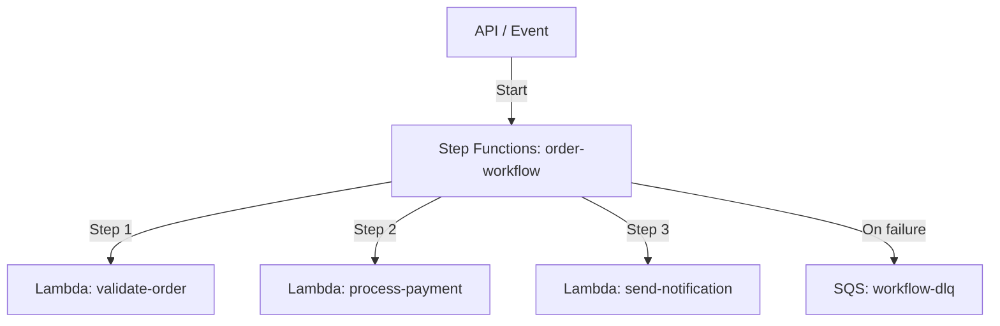

# Deploy a Step Functions Workflow with Lambda on AWS

This guide demonstrates how to use MechCloud's stateless IaC to provision an AWS Step Functions state machine orchestrating multiple Lambda functions for complex workflow automation.

## Scenario Overview
**Use Case:** An order processing pipeline where Step Functions orchestrates validation, payment processing, and notification steps — ideal for workflows requiring retry logic, parallel execution, and error handling without custom code.
**Key MechCloud Features Highlighted:**
- Cross-resource referencing (`ref:`)
- State machine definition as clean YAML (vs HCL jsonencode)
- Multiple Lambda functions in a single template

### Architecture Diagram



***

### Complete Unified Template

```yaml
resources:
  - type: aws_iam_role
    name: lambda-role
    props:
      role_name: "mc-sfn-lambda-role"
      assume_role_policy_document:
        Version: "2012-10-17"
        Statement:
          - Effect: Allow
            Principal:
              Service: lambda.amazonaws.com
            Action: "sts:AssumeRole"
      managed_policy_arns:
        - "arn:aws:iam::aws:policy/service-role/AWSLambdaBasicExecutionRole"

  - type: aws_iam_role
    name: sfn-role
    props:
      role_name: "mc-sfn-role"
      assume_role_policy_document:
        Version: "2012-10-17"
        Statement:
          - Effect: Allow
            Principal:
              Service: states.amazonaws.com
            Action: "sts:AssumeRole"
      managed_policy_arns:
        - "arn:aws:iam::aws:policy/service-role/AWSLambdaRole"

  - type: aws_lambda_function
    name: validate-order
    props:
      function_name: "mc-validate-order"
      runtime: python3.12
      handler: index.handler
      role: "ref:lambda-role.arn"
      timeout: 30
      code:
        zip_file: |
          def handler(event, context):
              order = event.get('order', {})
              if not order.get('items'):
                  raise ValueError("No items in order")
              return {'status': 'validated', 'order': order}

  - type: aws_lambda_function
    name: process-payment
    props:
      function_name: "mc-process-payment"
      runtime: python3.12
      handler: index.handler
      role: "ref:lambda-role.arn"
      timeout: 60
      code:
        zip_file: |
          def handler(event, context):
              return {'status': 'payment_processed', 'transaction_id': 'txn-12345'}

  - type: aws_lambda_function
    name: send-notification
    props:
      function_name: "mc-send-notification"
      runtime: python3.12
      handler: index.handler
      role: "ref:lambda-role.arn"
      timeout: 30
      code:
        zip_file: |
          def handler(event, context):
              return {'status': 'notification_sent'}

  - type: aws_sqs_queue
    name: workflow-dlq
    props:
      queue_name: "mc-workflow-dlq"
      message_retention_period: 1209600

  - type: aws_sfn_state_machine
    name: order-workflow
    props:
      name: "mc-order-workflow"
      role_arn: "ref:sfn-role.arn"
      definition:
        Comment: "Order processing workflow"
        StartAt: ValidateOrder
        States:
          ValidateOrder:
            Type: Task
            Resource: "ref:validate-order.arn"
            Next: ProcessPayment
            Catch:
              - ErrorEquals: ["States.ALL"]
                Next: HandleError
          ProcessPayment:
            Type: Task
            Resource: "ref:process-payment.arn"
            Next: SendNotification
            Retry:
              - ErrorEquals: ["States.TaskFailed"]
                MaxAttempts: 3
                IntervalSeconds: 5
                BackoffRate: 2
            Catch:
              - ErrorEquals: ["States.ALL"]
                Next: HandleError
          SendNotification:
            Type: Task
            Resource: "ref:send-notification.arn"
            End: true
          HandleError:
            Type: Fail
            Error: "WorkflowFailed"
            Cause: "An error occurred during order processing"
```
