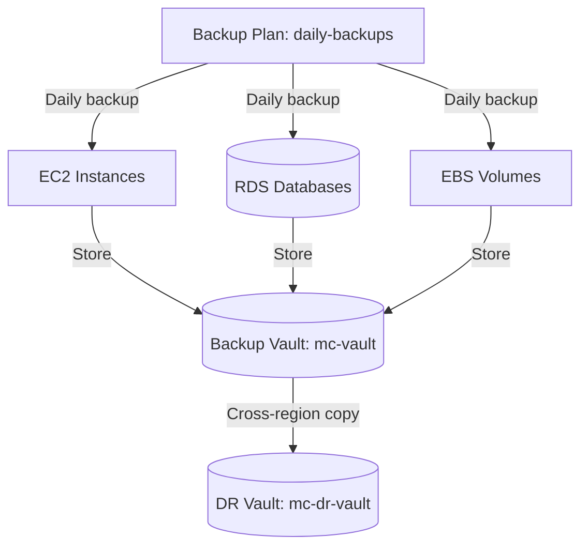

# Deploy AWS Backup Vault with Backup Plans on AWS

This guide demonstrates how to use MechCloud's stateless IaC to provision AWS Backup with a vault, backup plan, and resource selection for centralized backup management.

## Scenario Overview
**Use Case:** Centralized backup management across EC2, RDS, EBS, S3, and DynamoDB with automated schedules, retention policies, and cross-region copy — essential for business continuity and regulatory compliance.
**Key MechCloud Features Highlighted:**
- Cross-resource referencing (`ref:`)
- Backup plan rules and lifecycle as clean YAML
- Multi-resource backup selection

### Architecture Diagram



***

### Complete Unified Template

```yaml
resources:
  - type: aws_iam_role
    name: backup-role
    props:
      role_name: "mc-backup-role"
      assume_role_policy_document:
        Version: "2012-10-17"
        Statement:
          - Effect: Allow
            Principal:
              Service: backup.amazonaws.com
            Action: "sts:AssumeRole"
      managed_policy_arns:
        - "arn:aws:iam::aws:policy/service-role/AWSBackupServiceRolePolicyForBackup"
        - "arn:aws:iam::aws:policy/service-role/AWSBackupServiceRolePolicyForRestores"

  - type: aws_backup_vault
    name: mc-vault
    props:
      name: "mc-backup-vault"

  - type: aws_backup_vault
    name: mc-dr-vault
    props:
      name: "mc-dr-backup-vault"
      region: us-west-2

  - type: aws_backup_plan
    name: daily-backups
    props:
      name: "mc-daily-backup-plan"
      rules:
        - rule_name: daily-rule
          target_vault_name: "ref:mc-vault"
          schedule: "cron(0 2 * * ? *)"
          start_window: 60
          completion_window: 180
          lifecycle:
            delete_after: 35
            move_to_cold_storage_after: 30
          copy_actions:
            - destination_vault_arn: "ref:mc-dr-vault.arn"
              lifecycle:
                delete_after: 90
        - rule_name: weekly-rule
          target_vault_name: "ref:mc-vault"
          schedule: "cron(0 3 ? * SUN *)"
          start_window: 60
          completion_window: 360
          lifecycle:
            delete_after: 90

  - type: aws_backup_selection
    name: backup-selection
    props:
      name: "mc-backup-selection"
      iam_role_arn: "ref:backup-role.arn"
      plan_id: "ref:daily-backups"
      selection_tags:
        - type: STRINGEQUALS
          key: Backup
          value: "true"
      resources:
        - "arn:aws:ec2:*:*:instance/*"
        - "arn:aws:rds:*:*:db:*"
```
