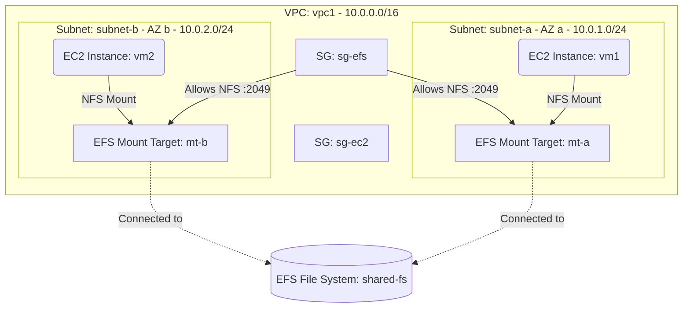

# Deploy EC2 Instances with Elastic File System (EFS) on AWS

This guide demonstrates how to use MechCloud's stateless Infrastructure-as-Code (IaC) to provision EC2 instances with a shared Amazon Elastic File System (EFS) for persistent, scalable file storage on AWS.

In this scenario, we deploy two EC2 instances in separate availability zones that both mount the same EFS file system. EFS provides a fully managed, elastic NFS file system that automatically grows and shrinks as files are added or removed, making it ideal for shared workloads.

## Scenario Overview
**Use Case:** A distributed application where multiple EC2 instances need shared access to the same file system — such as a content management system, shared configuration files, or a media processing pipeline.
**Key MechCloud Features Highlighted:**
- Hierarchical resource nesting (VPC $\rightarrow$ Subnet $\rightarrow$ EC2)
- Dynamic macros (`{{CURRENT_REGION}}`, `{{Image|arm64_ubuntu_24_04}}`)
- Cross-resource referencing (`ref:`)
- EFS with mount targets across multiple AZs

### Architecture Diagram



***

## Step 1: Setting up Networking

We create a VPC with two subnets in different availability zones and security groups for EC2 and EFS.

```yaml
resources:
  - type: aws_ec2_vpc
    name: vpc1
    props:
      cidr_block: "10.0.0.0/16"
    resources:
      - type: aws_ec2_subnet
        name: subnet-a
        props:
          cidr_block: "10.0.1.0/24"
          availability_zone: "{{CURRENT_REGION}}a"

      - type: aws_ec2_subnet
        name: subnet-b
        props:
          cidr_block: "10.0.2.0/24"
          availability_zone: "{{CURRENT_REGION}}b"

      # SG for EC2 instances
      - type: aws_ec2_security_group
        name: sg-ec2
        props:
          group_name: "mc-ec2-sg"
          group_description: "SG for EC2 instances"
          security_group_ingress:
            - ip_protocol: tcp
              from_port: 22
              to_port: 22
              cidr_ip: "10.0.0.0/16"

      # SG for EFS mount targets - allows NFS from EC2 SG
      - type: aws_ec2_security_group
        name: sg-efs
        props:
          group_name: "mc-efs-sg"
          group_description: "SG for EFS mount targets"
          security_group_ingress:
            - ip_protocol: tcp
              from_port: 2049
              to_port: 2049
              source_security_group_id: "ref:vpc1/sg-ec2"
```

## Step 2: Creating the EFS File System and Mount Targets

We provision an EFS file system with encryption enabled and create mount targets in each subnet.

```yaml
# ... (At root resources level) ...
  - type: aws_efs_file_system
    name: shared-fs
    props:
      encrypted: true
      performance_mode: generalPurpose
      throughput_mode: elastic

  - type: aws_efs_mount_target
    name: mt-a
    props:
      file_system_id: "ref:shared-fs"
      subnet_id: "ref:vpc1/subnet-a"
      security_groups:
        - "ref:vpc1/sg-efs"

  - type: aws_efs_mount_target
    name: mt-b
    props:
      file_system_id: "ref:shared-fs"
      subnet_id: "ref:vpc1/subnet-b"
      security_groups:
        - "ref:vpc1/sg-efs"
```

## Step 3: Provisioning EC2 Instances

We deploy two EC2 instances, one in each subnet. Both can mount the shared EFS file system via the mount targets in their respective subnets.

```yaml
# ... (Inside vpc1/subnet-a and vpc1/subnet-b resources blocks) ...
        # Inside subnet-a
        resources:
          - type: aws_ec2_instance
            name: vm1
            props:
              image_id: "{{Image|arm64_ubuntu_24_04}}"
              instance_type: "t4g.small"
              security_group_ids:
                - "ref:vpc1/sg-ec2"

        # Inside subnet-b
        resources:
          - type: aws_ec2_instance
            name: vm2
            props:
              image_id: "{{Image|arm64_ubuntu_24_04}}"
              instance_type: "t4g.small"
              security_group_ids:
                - "ref:vpc1/sg-ec2"
```

### Complete Unified Template

For your convenience, here is the complete, unified MechCloud template combining all steps:

```yaml
resources:
  - type: aws_ec2_vpc
    name: vpc1
    props:
      cidr_block: "10.0.0.0/16"
    resources:
      - type: aws_ec2_security_group
        name: sg-ec2
        props:
          group_name: "mc-ec2-sg"
          group_description: "SG for EC2 instances"
          security_group_ingress:
            - ip_protocol: tcp
              from_port: 22
              to_port: 22
              cidr_ip: "10.0.0.0/16"

      - type: aws_ec2_security_group
        name: sg-efs
        props:
          group_name: "mc-efs-sg"
          group_description: "SG for EFS mount targets"
          security_group_ingress:
            - ip_protocol: tcp
              from_port: 2049
              to_port: 2049
              source_security_group_id: "ref:vpc1/sg-ec2"

      - type: aws_ec2_subnet
        name: subnet-a
        props:
          cidr_block: "10.0.1.0/24"
          availability_zone: "{{CURRENT_REGION}}a"
        resources:
          - type: aws_ec2_instance
            name: vm1
            props:
              image_id: "{{Image|arm64_ubuntu_24_04}}"
              instance_type: "t4g.small"
              security_group_ids:
                - "ref:vpc1/sg-ec2"

      - type: aws_ec2_subnet
        name: subnet-b
        props:
          cidr_block: "10.0.2.0/24"
          availability_zone: "{{CURRENT_REGION}}b"
        resources:
          - type: aws_ec2_instance
            name: vm2
            props:
              image_id: "{{Image|arm64_ubuntu_24_04}}"
              instance_type: "t4g.small"
              security_group_ids:
                - "ref:vpc1/sg-ec2"

  - type: aws_efs_file_system
    name: shared-fs
    props:
      encrypted: true
      performance_mode: generalPurpose
      throughput_mode: elastic

  - type: aws_efs_mount_target
    name: mt-a
    props:
      file_system_id: "ref:shared-fs"
      subnet_id: "ref:vpc1/subnet-a"
      security_groups:
        - "ref:vpc1/sg-efs"

  - type: aws_efs_mount_target
    name: mt-b
    props:
      file_system_id: "ref:shared-fs"
      subnet_id: "ref:vpc1/subnet-b"
      security_groups:
        - "ref:vpc1/sg-efs"
```
