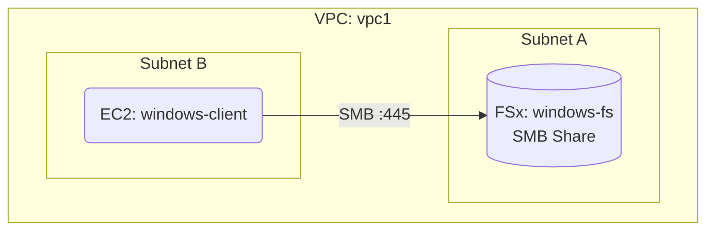

# Deploy Amazon FSx for Windows File Server on AWS

This guide demonstrates how to use MechCloud's stateless IaC to provision Amazon FSx for Windows File Server for fully managed Windows-native file shares.

## Scenario Overview
**Use Case:** Windows workloads requiring SMB file shares with Active Directory integration — ideal for home directories, application data, CMS content, and migrating on-premises Windows file servers to the cloud.
**Key MechCloud Features Highlighted:**
- Cross-resource referencing (`ref:`)
- FSx configuration with throughput and storage options
- VPC integration with security groups

### Architecture Diagram



***

### Complete Unified Template

```yaml
resources:
  - type: aws_ec2_vpc
    name: vpc1
    props:
      cidr_block: "10.0.0.0/16"
    resources:
      - type: aws_ec2_security_group
        name: sg-fsx
        props:
          group_name: "mc-fsx-sg"
          group_description: "SG for FSx Windows"
          security_group_ingress:
            - ip_protocol: tcp
              from_port: 445
              to_port: 445
              cidr_ip: "10.0.0.0/16"
            - ip_protocol: tcp
              from_port: 5985
              to_port: 5985
              cidr_ip: "10.0.0.0/16"
      - type: aws_ec2_subnet
        name: subnet-a
        props:
          cidr_block: "10.0.1.0/24"
          availability_zone: "{{CURRENT_REGION}}a"
      - type: aws_ec2_subnet
        name: subnet-b
        props:
          cidr_block: "10.0.2.0/24"
          availability_zone: "{{CURRENT_REGION}}b"

  - type: aws_fsx_windows_file_system
    name: windows-fs
    props:
      storage_capacity: 300
      subnet_ids:
        - "ref:vpc1/subnet-a"
      throughput_capacity: 32
      security_group_ids:
        - "ref:vpc1/sg-fsx"
      storage_type: SSD
      deployment_type: SINGLE_AZ_1
      automatic_backup_retention_days: 7
      copy_tags_to_backups: true
      self_managed_active_directory:
        dns_ips:
          - "10.0.1.10"
        domain_name: "corp.example.com"
        username: "Admin"
        password: "ChangeMe123!"
```
