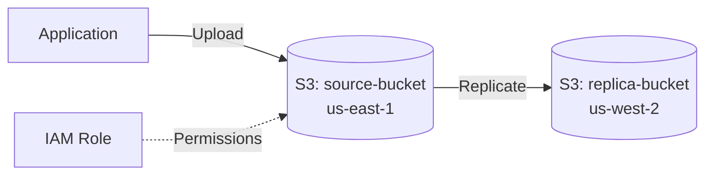

# Deploy S3 Buckets with Cross-Region Replication on AWS

This guide demonstrates how to use MechCloud's stateless IaC to provision S3 buckets with cross-region replication for disaster recovery and compliance.

## Scenario Overview
**Use Case:** Automatic replication of S3 objects to a bucket in a different region for disaster recovery, data locality compliance, or reduced-latency access — a critical pattern for globally distributed applications.
**Key MechCloud Features Highlighted:**
- Cross-resource referencing (`ref:`)
- Replication rules as nested YAML
- IAM role for replication service

### Architecture Diagram



***

### Complete Unified Template

```yaml
resources:
  - type: aws_iam_role
    name: replication-role
    props:
      role_name: "mc-s3-replication-role"
      assume_role_policy_document:
        Version: "2012-10-17"
        Statement:
          - Effect: Allow
            Principal:
              Service: s3.amazonaws.com
            Action: "sts:AssumeRole"

  - type: aws_iam_policy
    name: replication-policy
    props:
      policy_name: "mc-s3-replication-policy"
      policy_document:
        Version: "2012-10-17"
        Statement:
          - Effect: Allow
            Action:
              - "s3:GetReplicationConfiguration"
              - "s3:ListBucket"
            Resource: "arn:aws:s3:::mc-source-bucket"
          - Effect: Allow
            Action:
              - "s3:GetObjectVersionForReplication"
              - "s3:GetObjectVersionAcl"
              - "s3:GetObjectVersionTagging"
            Resource: "arn:aws:s3:::mc-source-bucket/*"
          - Effect: Allow
            Action:
              - "s3:ReplicateObject"
              - "s3:ReplicateDelete"
              - "s3:ReplicateTags"
            Resource: "arn:aws:s3:::mc-replica-bucket/*"

  - type: aws_iam_role_policy_attachment
    name: attach-replication
    props:
      role: "ref:replication-role"
      policy_arn: "ref:replication-policy.arn"

  - type: aws_s3_bucket
    name: source-bucket
    props:
      bucket_name: "mc-source-bucket"

  - type: aws_s3_bucket_versioning
    name: source-versioning
    props:
      bucket: "ref:source-bucket"
      versioning_configuration:
        status: Enabled

  - type: aws_s3_bucket
    name: replica-bucket
    props:
      bucket_name: "mc-replica-bucket"
      region: us-west-2

  - type: aws_s3_bucket_versioning
    name: replica-versioning
    props:
      bucket: "ref:replica-bucket"
      versioning_configuration:
        status: Enabled

  - type: aws_s3_bucket_replication_configuration
    name: replication-config
    props:
      bucket: "ref:source-bucket"
      role: "ref:replication-role.arn"
      rules:
        - id: replicate-all
          status: Enabled
          destination:
            bucket: "ref:replica-bucket.arn"
            storage_class: STANDARD_IA
```
