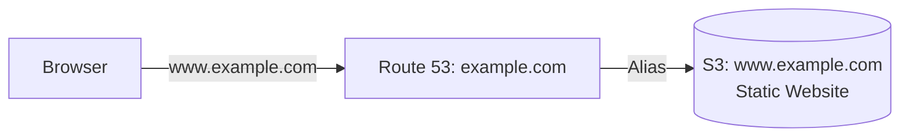

# Deploy an S3 Static Website with Custom Domain on AWS

This guide demonstrates how to use MechCloud's stateless IaC to provision an S3 bucket configured as a static website with Route 53 DNS.

## Scenario Overview
**Use Case:** Hosting a static website (HTML, CSS, JS) directly from S3 with a custom domain name — the simplest and most cost-effective way to serve static content without managing any web servers.
**Key MechCloud Features Highlighted:**
- Cross-resource referencing (`ref:`)
- S3 website configuration as clean YAML
- Bucket policy for public read access

### Architecture Diagram



***

### Complete Unified Template

```yaml
resources:
  - type: aws_s3_bucket
    name: website-bucket
    props:
      bucket_name: "mc-static-website"

  - type: aws_s3_bucket_website_configuration
    name: website-config
    props:
      bucket: "ref:website-bucket"
      index_document:
        suffix: index.html
      error_document:
        key: error.html

  - type: aws_s3_bucket_public_access_block
    name: website-public-access
    props:
      bucket: "ref:website-bucket"
      block_public_acls: false
      block_public_policy: false
      ignore_public_acls: false
      restrict_public_buckets: false

  - type: aws_s3_bucket_policy
    name: website-policy
    props:
      bucket: "ref:website-bucket"
      policy:
        Version: "2012-10-17"
        Statement:
          - Sid: PublicReadGetObject
            Effect: Allow
            Principal: "*"
            Action: "s3:GetObject"
            Resource: "ref:website-bucket.arn/*"

  - type: aws_route53_hosted_zone
    name: zone1
    props:
      name: "example.com"

  - type: aws_route53_record
    name: website-alias
    props:
      zone_id: "ref:zone1"
      name: "www.example.com"
      type: A
      alias:
        name: "ref:website-bucket.website_domain"
        zone_id: "ref:website-bucket.hosted_zone_id"
        evaluate_target_health: false
```
